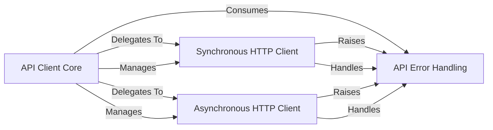

## Component Details

This subsystem provides the core functionality for interacting with the Ollama API, offering both synchronous and asynchronous interfaces, robust error handling, and foundational HTTP communication.

### API Client Core

This component serves as the primary entry point for users, providing both synchronous (`Client`) and asynchronous (`AsyncClient`) interfaces to interact with the Ollama API. It encapsulates the foundational setup, including host URL parsing, HTTP client initialization (`httpx`), and default configurations (headers, timeouts). It acts as the orchestrator, exposing high-level methods that delegate to specific API functionalities.

**Related Classes/Methods**:

- <a href="https://github.com/ollama/ollama-python/blob/master/ollama/_client.py#L73-L107" target="_blank" rel="noopener noreferrer">`ollama._client.BaseClient` (73:107)</a>

- <a href="https://github.com/ollama/ollama-python/blob/master/ollama/_client.py#L113-L622" target="_blank" rel="noopener noreferrer">`ollama._client.Client` (113:622)</a>

- <a href="https://github.com/ollama/ollama-python/blob/master/ollama/_client.py#L625-L1142" target="_blank" rel="noopener noreferrer">`ollama._client.AsyncClient` (625:1142)</a>

### Synchronous HTTP Client

This component provides the functionality for making synchronous HTTP requests to the Ollama API. It handles the low-level network communication, request preparation, and initial error detection for blocking operations. It is a specialized part of the `API Client Core`, specifically implemented within the `Client` class.

**Related Classes/Methods**:

- <a href="https://github.com/ollama/ollama-python/blob/master/ollama/_client.py#L117-L125" target="_blank" rel="noopener noreferrer">`ollama._client.Client._request_raw` (117:125)</a>

- <a href="https://github.com/ollama/ollama-python/blob/master/ollama/_client.py#L128-L134" target="_blank" rel="noopener noreferrer">`ollama._client.Client._request` (128:134)</a>

### Asynchronous HTTP Client

This component mirrors the Synchronous HTTP Client but is designed for non-blocking, asynchronous operations. It enables concurrent communication with the Ollama API, which is essential for applications requiring high performance or integration into asynchronous frameworks. It is a specialized part of the `API Client Core`, specifically implemented within the `AsyncClient` class.

**Related Classes/Methods**:

- <a href="https://github.com/ollama/ollama-python/blob/master/ollama/_client.py#L629-L637" target="_blank" rel="noopener noreferrer">`ollama._client.AsyncClient._request_raw` (629:637)</a>

- <a href="https://github.com/ollama/ollama-python/blob/master/ollama/_client.py#L640-L646" target="_blank" rel="noopener noreferrer">`ollama._client.AsyncClient._request` (640:646)</a>

### API Error Handling

This component defines a custom exception class (`ResponseError`) specifically for errors returned by the Ollama API. It standardizes how API-specific errors are represented, providing details like the error message and HTTP status code. This ensures consistent and user-friendly error management across both synchronous and asynchronous client interactions.

**Related Classes/Methods**:

- <a href="https://github.com/ollama/ollama-python/blob/master/ollama/_types.py#L547-L566" target="_blank" rel="noopener noreferrer">`ollama._types.ResponseError` (547:566)</a>

### [FAQ](https://github.com/CodeBoarding/GeneratedOnBoardings/tree/main?tab=readme-ov-file#faq)