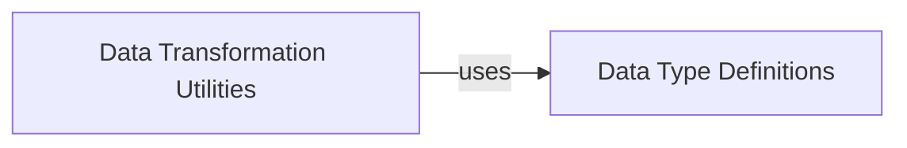

## Component Details

This analysis focuses on two fundamental components within the `ollama-python` library: `Data Transformation Utilities` and `Data Type Definitions`. These components are crucial for ensuring that data is correctly structured, validated, and exchanged within the library and with the Ollama API.

### Data Transformation Utilities

This component provides a set of helper functions responsible for transforming and preparing various complex data types (such as images, message lists, and Python functions) into the specific formats required by the Ollama API. It abstracts away the complexities of data formatting, ensuring that data is correctly structured and encoded before being sent in API requests. This component is fundamental because it acts as an essential intermediary, translating diverse user inputs into the standardized data models expected by the Ollama API, thereby simplifying client-side interactions and preventing data inconsistencies.

**Related Classes/Methods**:

- <a href="https://github.com/ollama/ollama-python/blob/master/ollama/_client.py#L1145-L1147" target="_blank" rel="noopener noreferrer">`ollama._client._copy_images` (1145:1147)</a>

- <a href="https://github.com/ollama/ollama-python/blob/master/ollama/_client.py#L1150-L1154" target="_blank" rel="noopener noreferrer">`ollama._client._copy_messages` (1150:1154)</a>

- <a href="https://github.com/ollama/ollama-python/blob/master/ollama/_client.py#L1157-L1159" target="_blank" rel="noopener noreferrer">`ollama._client._copy_tools` (1157:1159)</a>

- <a href="https://github.com/ollama/ollama-python/blob/master/ollama/_utils.py#L55-L88" target="_blank" rel="noopener noreferrer">`ollama._utils.convert_function_to_tool` (55:88)</a>

- <a href="https://github.com/ollama/ollama-python/blob/master/ollama/_utils.py#L12-L52" target="_blank" rel="noopener noreferrer">`ollama._utils._parse_docstring` (12:52)</a>

### Data Type Definitions

This foundational component defines the canonical data structures and models used across the `ollama-python` library. These types (e.g., `Image`, `Tool`, `Tool.Function`, and `Tool.Function.Parameters`) are primarily Pydantic models that enforce data consistency, facilitate clear communication with the Ollama API, and serve as the common language for data exchange within the library. This component is fundamental as it establishes the schema and validation rules for all data, ensuring type safety, predictable data structures, and robust error handling throughout the system.

**Related Classes/Methods**:

- <a href="https://github.com/ollama/ollama-python/blob/master/ollama/_types.py#L160-L185" target="_blank" rel="noopener noreferrer">`ollama._types.Image` (160:185)</a>

- <a href="https://github.com/ollama/ollama-python/blob/master/ollama/_types.py#L311-L337" target="_blank" rel="noopener noreferrer">`ollama._types.Tool` (311:337)</a>

- <a href="https://github.com/ollama/ollama-python/blob/master/ollama/_types.py#L314-L335" target="_blank" rel="noopener noreferrer">`ollama._types.Tool.Function` (314:335)</a>

- `ollama._types.Tool.Function.Parameters` (0:0)

- <a href="https://github.com/ollama/ollama-python/blob/master/ollama/_types.py#L260-L308" target="_blank" rel="noopener noreferrer">`ollama._types.Message` (260:308)</a>

### [FAQ](https://github.com/CodeBoarding/GeneratedOnBoardings/tree/main?tab=readme-ov-file#faq)