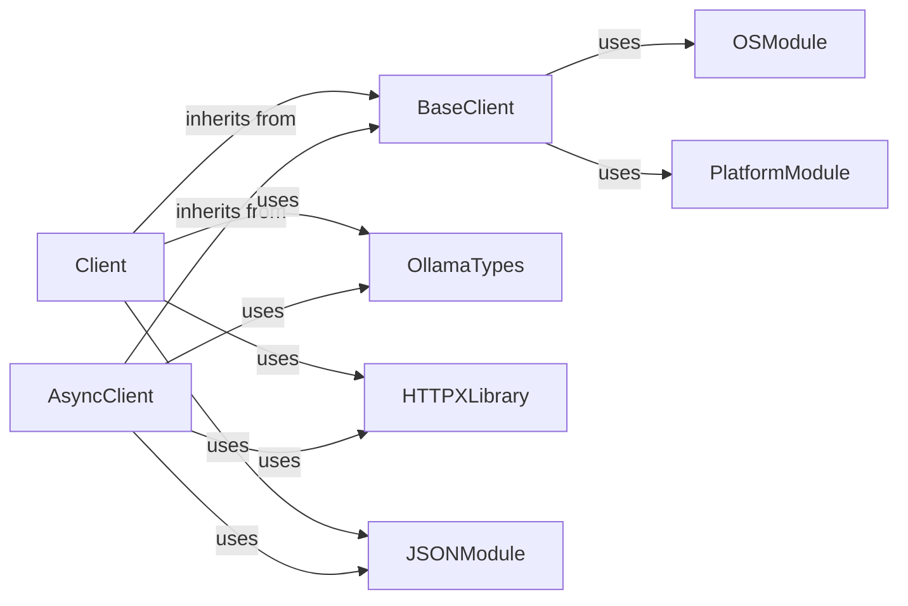

## Component Details

The `HTTP Communication Layer` is a critical subsystem within the `ollama` project, primarily responsible for all network interactions with the Ollama API. It ensures reliable, structured, and efficient communication by handling low-level HTTP requests, data serialization/deserialization, and robust error management.

### BaseClient

Serves as the foundational abstract class for both synchronous and asynchronous Ollama clients. It encapsulates the core logic for initializing the underlying `httpx` client, including setting the base URL, default headers (e.g., `User-Agent`, `Content-Type`, `Accept`), and processing environment variables like `OLLAMA_HOST`.

**Related Classes/Methods**: _None_

### Client

Extends `BaseClient` to provide the concrete implementation for making *synchronous* API requests to the Ollama service. It contains the `_request_raw` method for low-level HTTP execution and the `_request` method for higher-level request orchestration, which includes Python object serialization to JSON, JSON response deserialization to Python objects, and comprehensive error handling (e.g., `ResponseError`).

**Related Classes/Methods**:

- <a href="https://github.com/ollama/ollama-python/blob/master/ollama/_client.py#L117-L125" target="_blank" rel="noopener noreferrer">`ollama._client.Client:_request_raw` (117:125)</a>

- <a href="https://github.com/ollama/ollama-python/blob/master/ollama/_client.py#L128-L134" target="_blank" rel="noopener noreferrer">`ollama._client.Client:_request` (128:134)</a>

- <a href="https://github.com/ollama/ollama-python/blob/master/ollama/_client.py#L0-L0" target="_blank" rel="noopener noreferrer">`ollama._client.ResponseError` (0:0)</a>

### AsyncClient

Also extends `BaseClient`, providing the concrete implementation for making *asynchronous* API requests to the Ollama service. Similar to `Client`, it includes `_request_raw` and `_request` methods, but adapted for asynchronous HTTP execution and request orchestration.

**Related Classes/Methods**:

- <a href="https://github.com/ollama/ollama-python/blob/master/ollama/_client.py#L629-L637" target="_blank" rel="noopener noreferrer">`ollama._client.AsyncClient:_request_raw` (629:637)</a>

- <a href="https://github.com/ollama/ollama-python/blob/master/ollama/_client.py#L640-L646" target="_blank" rel="noopener noreferrer">`ollama._client.AsyncClient:_request` (640:646)</a>

### OllamaTypes

This module defines the essential data structures (e.g., `ChatRequest`, `GenerateResponse`, `Options`) that represent the request payloads sent to and response payloads received from the Ollama API. It ensures type safety and clarity for data exchange.

**Related Classes/Methods**:

- <a href="https://github.com/ollama/ollama-python/blob/master/ollama/_types.py#L340-L357" target="_blank" rel="noopener noreferrer">`ollama._types.ChatRequest` (340:357)</a>

- <a href="https://github.com/ollama/ollama-python/blob/master/ollama/_types.py#L245-L257" target="_blank" rel="noopener noreferrer">`ollama._types.GenerateResponse` (245:257)</a>

- <a href="https://github.com/ollama/ollama-python/blob/master/ollama/_types.py#L103-L136" target="_blank" rel="noopener noreferrer">`ollama._types.Options` (103:136)</a>

### HTTPXLibrary

External library used for performing HTTP network requests.

**Related Classes/Methods**: _None_

### JSONModule

Python's built-in module for JSON serialization and deserialization.

**Related Classes/Methods**: _None_

### OSModule

Python's built-in module for interacting with the operating system, e.g., environment variables.

**Related Classes/Methods**: _None_

### PlatformModule

Python's built-in module for accessing underlying platform's identifying data.

**Related Classes/Methods**: _None_

### [FAQ](https://github.com/CodeBoarding/GeneratedOnBoardings/tree/main?tab=readme-ov-file#faq)