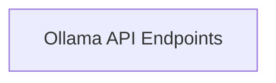

## Component Details

One paragraph explaining the functionality which is represented by this graph. What the main flow is and what is its purpose.

### Ollama API Endpoints

This component groups all the specific functionalities exposed by the Ollama API. Each method (e.g., `generate`, `chat`, `embed`, `pull`, `push`, `create_blob`) prepares the specific request data, often utilizing `Data Transformation Utilities`, and then delegates the actual HTTP communication to the `HTTP Communication Layer`. It represents the business logic for each distinct API operation.

**Related Classes/Methods**:

- <a href="https://github.com/ollama/ollama-python/blob/master/ollama/_client.py#L182-L198" target="_blank" rel="noopener noreferrer">`ollama._client.Client.generate` (182:198)</a>

- <a href="https://github.com/ollama/ollama-python/blob/master/ollama/_client.py#L694-L710" target="_blank" rel="noopener noreferrer">`ollama._client.AsyncClient.generate` (694:710)</a>

- <a href="https://github.com/ollama/ollama-python/blob/master/ollama/_client.py#L269-L280" target="_blank" rel="noopener noreferrer">`ollama._client.Client.chat` (269:280)</a>

- <a href="https://github.com/ollama/ollama-python/blob/master/ollama/_client.py#L780-L791" target="_blank" rel="noopener noreferrer">`ollama._client.AsyncClient.chat` (780:791)</a>

- <a href="https://github.com/ollama/ollama-python/blob/master/ollama/_client.py#L358-L377" target="_blank" rel="noopener noreferrer">`ollama._client.Client.embed` (358:377)</a>

- <a href="https://github.com/ollama/ollama-python/blob/master/ollama/_client.py#L870-L889" target="_blank" rel="noopener noreferrer">`ollama._client.AsyncClient.embed` (870:889)</a>

- <a href="https://github.com/ollama/ollama-python/blob/master/ollama/_client.py#L402-L408" target="_blank" rel="noopener noreferrer">`ollama._client.Client.pull` (402:408)</a>

- <a href="https://github.com/ollama/ollama-python/blob/master/ollama/_client.py#L914-L920" target="_blank" rel="noopener noreferrer">`ollama._client.AsyncClient.pull` (914:920)</a>

- <a href="https://github.com/ollama/ollama-python/blob/master/ollama/_client.py#L444-L450" target="_blank" rel="noopener noreferrer">`ollama._client.Client.push` (444:450)</a>

- <a href="https://github.com/ollama/ollama-python/blob/master/ollama/_client.py#L956-L962" target="_blank" rel="noopener noreferrer">`ollama._client.AsyncClient.push` (956:962)</a>

- <a href="https://github.com/ollama/ollama-python/blob/master/ollama/_client.py#L559-L573" target="_blank" rel="noopener noreferrer">`ollama._client.Client.create_blob` (559:573)</a>

- <a href="https://github.com/ollama/ollama-python/blob/master/ollama/_client.py#L1072-L1093" target="_blank" rel="noopener noreferrer">`ollama._client.AsyncClient.create_blob` (1072:1093)</a>

- <a href="https://github.com/ollama/ollama-python/blob/master/ollama/_client.py#L575-L580" target="_blank" rel="noopener noreferrer">`ollama._client.Client.list` (575:580)</a>

- <a href="https://github.com/ollama/ollama-python/blob/master/ollama/_client.py#L1095-L1100" target="_blank" rel="noopener noreferrer">`ollama._client.AsyncClient.list` (1095:1100)</a>

- <a href="https://github.com/ollama/ollama-python/blob/master/ollama/_client.py#L582-L592" target="_blank" rel="noopener noreferrer">`ollama._client.Client.delete` (582:592)</a>

- <a href="https://github.com/ollama/ollama-python/blob/master/ollama/_client.py#L1102-L1112" target="_blank" rel="noopener noreferrer">`ollama._client.AsyncClient.delete` (1102:1112)</a>

- <a href="https://github.com/ollama/ollama-python/blob/master/ollama/_client.py#L594-L605" target="_blank" rel="noopener noreferrer">`ollama._client.Client.copy` (594:605)</a>

- <a href="https://github.com/ollama/ollama-python/blob/master/ollama/_client.py#L1114-L1125" target="_blank" rel="noopener noreferrer">`ollama._client.AsyncClient.copy` (1114:1125)</a>

- <a href="https://github.com/ollama/ollama-python/blob/master/ollama/_client.py#L607-L615" target="_blank" rel="noopener noreferrer">`ollama._client.Client.show` (607:615)</a>

- <a href="https://github.com/ollama/ollama-python/blob/master/ollama/_client.py#L1127-L1135" target="_blank" rel="noopener noreferrer">`ollama._client.AsyncClient.show` (1127:1135)</a>

- <a href="https://github.com/ollama/ollama-python/blob/master/ollama/_client.py#L617-L622" target="_blank" rel="noopener noreferrer">`ollama._client.Client.ps` (617:622)</a>

- <a href="https://github.com/ollama/ollama-python/blob/master/ollama/_client.py#L1137-L1142" target="_blank" rel="noopener noreferrer">`ollama._client.AsyncClient.ps` (1137:1142)</a>

- <a href="https://github.com/ollama/ollama-python/blob/master/ollama/_client.py#L379-L399" target="_blank" rel="noopener noreferrer">`ollama._client.Client.embeddings` (379:399)</a>

- <a href="https://github.com/ollama/ollama-python/blob/master/ollama/_client.py#L891-L911" target="_blank" rel="noopener noreferrer">`ollama._client.AsyncClient.embeddings` (891:911)</a>

### [FAQ](https://github.com/CodeBoarding/GeneratedOnBoardings/tree/main?tab=readme-ov-file#faq)