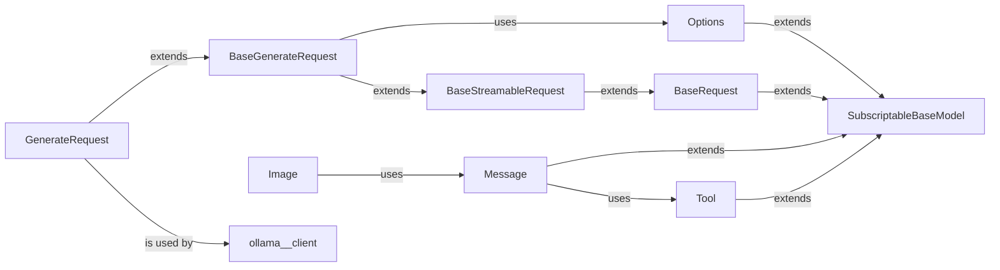

## Component Details

This component, primarily defined within `ollama/_types.py`, is the foundational layer for all data exchange with the Ollama API. It leverages Pydantic to define robust, type-safe data structures for requests, responses, and various nested data types. This ensures data integrity, facilitates serialization to and deserialization from JSON, and provides clear contracts for API interactions.

### SubscriptableBaseModel

The fundamental base class for most data models in this component. It extends Pydantic's BaseModel by adding dictionary-like access (`__getitem__`, `__setitem__`, `__contains__`, `get`) to model fields, enhancing usability and flexibility.

**Related Classes/Methods**:

- <a href="https://github.com/ollama/ollama-python/blob/master/ollama/_types.py#L18-L100" target="_blank" rel="noopener noreferrer">`ollama._types.SubscriptableBaseModel` (18:100)</a>

### Options

A Pydantic model defining a comprehensive set of configurable parameters for controlling the behavior of the Ollama model during both load time (e.g., `num_ctx`, `num_gpu`) and runtime (e.g., `temperature`, `top_p`, `stop`).

**Related Classes/Methods**:

- <a href="https://github.com/ollama/ollama-python/blob/master/ollama/_types.py#L103-L136" target="_blank" rel="noopener noreferrer">`ollama._types.Options` (103:136)</a>

### BaseRequest

An abstract base class for all API request models. It defines common fields applicable to most Ollama API requests, such as the `model` identifier.

**Related Classes/Methods**:

- <a href="https://github.com/ollama/ollama-python/blob/master/ollama/_types.py#L139-L141" target="_blank" rel="noopener noreferrer">`ollama._types.BaseRequest` (139:141)</a>

### BaseStreamableRequest

An abstract base class that extends `BaseRequest` by introducing the `stream` field, which controls whether the API response should be streamed or returned as a single block.

**Related Classes/Methods**:

- <a href="https://github.com/ollama/ollama-python/blob/master/ollama/_types.py#L144-L146" target="_blank" rel="noopener noreferrer">`ollama._types.BaseStreamableRequest` (144:146)</a>

### BaseGenerateRequest

An abstract base class for requests related to text generation. It extends `BaseStreamableRequest` and includes fields for `options` (referencing the `Options` model), `format` (for response formatting), and `keep_alive` (for model persistence).

**Related Classes/Methods**:

- <a href="https://github.com/ollama/ollama-python/blob/master/ollama/_types.py#L149-L157" target="_blank" rel="noopener noreferrer">`ollama._types.BaseGenerateRequest` (149:157)</a>

### GenerateRequest

A concrete Pydantic model for initiating text generation requests. It inherits from `BaseGenerateRequest` and adds specific fields like `prompt`, `suffix`, `system`, and `template` to define the input for the generation task.

**Related Classes/Methods**:

- <a href="https://github.com/ollama/ollama-python/blob/master/ollama/_types.py#L188-L210" target="_blank" rel="noopener noreferrer">`ollama._types.GenerateRequest` (188:210)</a>

### Image

A Pydantic model designed to handle image data within requests. It supports various input types (string, bytes, Path) and includes a custom serializer to ensure images are correctly encoded into base64 strings for API transmission.

**Related Classes/Methods**:

- <a href="https://github.com/ollama/ollama-python/blob/master/ollama/_types.py#L160-L185" target="_blank" rel="noopener noreferrer">`ollama._types.Image` (160:185)</a>

### Message

(Inferred from context and docstrings) A core Pydantic model representing a single message in a chat conversation. It typically includes fields like `role` (e.g., 'user', 'assistant', 'system') and `content`, and can optionally include `images` or `tool_calls`.

**Related Classes/Methods**:

- <a href="https://github.com/ollama/ollama-python/blob/master/ollama/_types.py#L260-L308" target="_blank" rel="noopener noreferrer">`ollama._types.Message` (260:308)</a>

### Tool

(Inferred from context and docstrings) A Pydantic model defining the structure of a tool that the model can call. It typically includes a `type` field and details about the tool's `function` (e.g., name, description, parameters).

**Related Classes/Methods**:

- <a href="https://github.com/ollama/ollama-python/blob/master/ollama/_types.py#L311-L337" target="_blank" rel="noopener noreferrer">`ollama._types.Tool` (311:337)</a>

### [FAQ](https://github.com/CodeBoarding/GeneratedOnBoardings/tree/main?tab=readme-ov-file#faq)