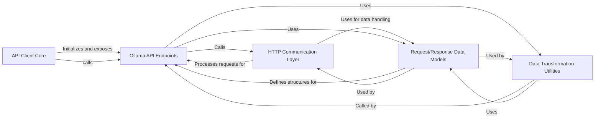

## Component Details

The `ollama-python` library's architecture is designed around a clear separation of concerns, facilitating both synchronous and asynchronous interactions with the Ollama API. The core design principles revolve around a central client, a dedicated HTTP communication layer, well-defined API endpoints, robust data modeling, and utility functions for data preparation.

### API Client Core

This component serves as the primary entry point for users, providing both synchronous (`Client`) and asynchronous (`AsyncClient`) interfaces to interact with the Ollama API. It encapsulates the foundational setup, including host URL parsing, HTTP client initialization (`httpx`), and default configurations (headers, timeouts). It acts as the orchestrator, exposing high-level methods that delegate to specific API functionalities.

**Related Classes/Methods**:

- <a href="https://github.com/ollama/ollama-python/blob/master/ollama/_client.py#L73-L107" target="_blank" rel="noopener noreferrer">`ollama._client.BaseClient` (73:107)</a>

- <a href="https://github.com/ollama/ollama-python/blob/master/ollama/_client.py#L113-L622" target="_blank" rel="noopener noreferrer">`ollama._client.Client` (113:622)</a>

- <a href="https://github.com/ollama/ollama-python/blob/master/ollama/_client.py#L625-L1142" target="_blank" rel="noopener noreferrer">`ollama._client.AsyncClient` (625:1142)</a>

### HTTP Communication Layer

Responsible for all network interactions with the Ollama API. This component handles the low-level execution of raw HTTP requests (`_request_raw`) and the higher-level orchestration (`_request`), which includes request data serialization (Python objects to JSON), response deserialization (JSON to Python objects), and comprehensive error handling (e.g., `ResponseError`). It ensures reliable and structured communication with the Ollama server.

**Related Classes/Methods**:

- <a href="https://github.com/ollama/ollama-python/blob/master/ollama/_client.py#L117-L125" target="_blank" rel="noopener noreferrer">`ollama._client.Client._request_raw` (117:125)</a>

- <a href="https://github.com/ollama/ollama-python/blob/master/ollama/_client.py#L629-L637" target="_blank" rel="noopener noreferrer">`ollama._client.AsyncClient._request_raw` (629:637)</a>

- <a href="https://github.com/ollama/ollama-python/blob/master/ollama/_client.py#L128-L134" target="_blank" rel="noopener noreferrer">`ollama._client.Client._request` (128:134)</a>

- <a href="https://github.com/ollama/ollama-python/blob/master/ollama/_client.py#L640-L646" target="_blank" rel="noopener noreferrer">`ollama._client.AsyncClient._request` (640:646)</a>

### Ollama API Endpoints

This component groups all the specific functionalities exposed by the Ollama API. Each method (e.g., `generate`, `chat`, `embed`, `pull`, `push`, `create_blob`) prepares the specific request data, often utilizing `Data Transformation Utilities`, and then delegates the actual HTTP communication to the `HTTP Communication Layer`. It represents the business logic for each distinct API operation.

**Related Classes/Methods**:

- <a href="https://github.com/ollama/ollama-python/blob/master/ollama/_client.py#L182-L198" target="_blank" rel="noopener noreferrer">`ollama._client.Client.generate` (182:198)</a>

- <a href="https://github.com/ollama/ollama-python/blob/master/ollama/_client.py#L694-L710" target="_blank" rel="noopener noreferrer">`ollama._client.AsyncClient.generate` (694:710)</a>

- <a href="https://github.com/ollama/ollama-python/blob/master/ollama/_client.py#L269-L280" target="_blank" rel="noopener noreferrer">`ollama._client.Client.chat` (269:280)</a>

- <a href="https://github.com/ollama/ollama-python/blob/master/ollama/_client.py#L780-L791" target="_blank" rel="noopener noreferrer">`ollama._client.AsyncClient.chat` (780:791)</a>

- <a href="https://github.com/ollama/ollama-python/blob/master/ollama/_client.py#L358-L377" target="_blank" rel="noopener noreferrer">`ollama._client.Client.embed` (358:377)</a>

- <a href="https://github.com/ollama/ollama-python/blob/master/ollama/_client.py#L870-L889" target="_blank" rel="noopener noreferrer">`ollama._client.AsyncClient.embed` (870:889)</a>

- <a href="https://github.com/ollama/ollama-python/blob/master/ollama/_client.py#L402-L408" target="_blank" rel="noopener noreferrer">`ollama._client.Client.pull` (402:408)</a>

- <a href="https://github.com/ollama/ollama-python/blob/master/ollama/_client.py#L914-L920" target="_blank" rel="noopener noreferrer">`ollama._client.AsyncClient.pull` (914:920)</a>

- <a href="https://github.com/ollama/ollama-python/blob/master/ollama/_client.py#L444-L450" target="_blank" rel="noopener noreferrer">`ollama._client.Client.push` (444:450)</a>

- <a href="https://github.com/ollama/ollama-python/blob/master/ollama/_client.py#L956-L962" target="_blank" rel="noopener noreferrer">`ollama._client.AsyncClient.push` (956:962)</a>

- <a href="https://github.com/ollama/ollama-python/blob/master/ollama/_client.py#L559-L573" target="_blank" rel="noopener noreferrer">`ollama._client.Client.create_blob` (559:573)</a>

- <a href="https://github.com/ollama/ollama-python/blob/master/ollama/_client.py#L1072-L1093" target="_blank" rel="noopener noreferrer">`ollama._client.AsyncClient.create_blob` (1072:1093)</a>

- <a href="https://github.com/ollama/ollama-python/blob/master/ollama/_client.py#L575-L580" target="_blank" rel="noopener noreferrer">`ollama._client.Client.list` (575:580)</a>

- <a href="https://github.com/ollama/ollama-python/blob/master/ollama/_client.py#L1095-L1100" target="_blank" rel="noopener noreferrer">`ollama._client.AsyncClient.list` (1095:1100)</a>

- <a href="https://github.com/ollama/ollama-python/blob/master/ollama/_client.py#L582-L592" target="_blank" rel="noopener noreferrer">`ollama._client.Client.delete` (582:592)</a>

- <a href="https://github.com/ollama/ollama-python/blob/master/ollama/_client.py#L1102-L1112" target="_blank" rel="noopener noreferrer">`ollama._client.AsyncClient.delete` (1102:1112)</a>

- <a href="https://github.com/ollama/ollama-python/blob/master/ollama/_client.py#L594-L605" target="_blank" rel="noopener noreferrer">`ollama._client.Client.copy` (594:605)</a>

- <a href="https://github.com/ollama/ollama-python/blob/master/ollama/_client.py#L1114-L1125" target="_blank" rel="noopener noreferrer">`ollama._client.AsyncClient.copy` (1114:1125)</a>

- <a href="https://github.com/ollama/ollama-python/blob/master/ollama/_client.py#L607-L615" target="_blank" rel="noopener noreferrer">`ollama._client.Client.show` (607:615)</a>

- <a href="https://github.com/ollama/ollama-python/blob/master/ollama/_client.py#L1127-L1135" target="_blank" rel="noopener noreferrer">`ollama._client.AsyncClient.show` (1127:1135)</a>

- <a href="https://github.com/ollama/ollama-python/blob/master/ollama/_client.py#L617-L622" target="_blank" rel="noopener noreferrer">`ollama._client.Client.ps` (617:622)</a>

- <a href="https://github.com/ollama/ollama-python/blob/master/ollama/_client.py#L1137-L1142" target="_blank" rel="noopener noreferrer">`ollama._client.AsyncClient.ps` (1137:1142)</a>

- <a href="https://github.com/ollama/ollama-python/blob/master/ollama/_client.py#L379-L399" target="_blank" rel="noopener noreferrer">`ollama._client.Client.embeddings` (379:399)</a>

- <a href="https://github.com/ollama/ollama-python/blob/master/ollama/_client.py#L891-L911" target="_blank" rel="noopener noreferrer">`ollama._client.AsyncClient.embeddings` (891:911)</a>

### Request/Response Data Models

This component comprises all the Pydantic models that define the structured data for requests sent to and responses received from the Ollama API. This includes models for various API operations (e.g., `GenerateRequest`, `ChatRequest`), their corresponding responses, and common types like `Options`, `Message`, `Tool`, and error structures. These models are crucial for data validation, serialization, and deserialization, ensuring type safety and consistency.

**Related Classes/Methods**:

- <a href="https://github.com/ollama/ollama-python/blob/master/ollama/_types.py#L0-L0" target="_blank" rel="noopener noreferrer">`ollama._types` (0:0)</a>

### Data Transformation Utilities

This component consists of helper functions responsible for transforming or preparing complex data types (like images, message lists, or Python functions intended as tools) into the specific format required by the Ollama API. These utilities ensure that data is correctly structured and encoded before being sent as part of an API request, abstracting away the complexities of data formatting.

**Related Classes/Methods**:

- <a href="https://github.com/ollama/ollama-python/blob/master/ollama/_client.py#L1145-L1147" target="_blank" rel="noopener noreferrer">`ollama._client._copy_images` (1145:1147)</a>

- <a href="https://github.com/ollama/ollama-python/blob/master/ollama/_client.py#L1150-L1154" target="_blank" rel="noopener noreferrer">`ollama._client._copy_messages` (1150:1154)</a>

- <a href="https://github.com/ollama/ollama-python/blob/master/ollama/_client.py#L1157-L1159" target="_blank" rel="noopener noreferrer">`ollama._client._copy_tools` (1157:1159)</a>

- <a href="https://github.com/ollama/ollama-python/blob/master/ollama/_utils.py#L55-L88" target="_blank" rel="noopener noreferrer">`ollama._utils.convert_function_to_tool` (55:88)</a>

### [FAQ](https://github.com/CodeBoarding/GeneratedOnBoardings/tree/main?tab=readme-ov-file#faq)